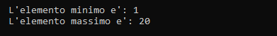

# Recursive sequential search of max and min value whith a pair
Implementazione ricorsiva dell'algoritmo di ricerca dei valori minimo e 
del valore massimo presenti all'interno di un vettore.

## Componenti della ricorsione
1. **Condizioni di terminazione:** `if(n <= 0)`
2. **Istruzione di terminazione:** `return p`
3. **Passo di avvicinamento:** `n-1`
4. **Chiamata ricorsiva:** `return ricerca_min(v, n-1, p)`

## Utilizzo
1. Crea in Code::Blocks un nuovo progetto.
2. Copia il codice sorgente.
3. Compila ed esegui.

## Codice sorgente
```cpp
#include <iostream>
#include <utility>

std::pair<int,int> ricerca_min_max(int v[], int n, std::pair<int, int> p);

int main(){
    int lung_vett = 20;
    int vett[lung_vett] = {1,2,3,4,5,6,7,8,9,10,11,12,13,14,15,16,17,18,19,20};

    std::pair<int, int> min_max;
    min_max.first = vett[0];
    min_max.second = vett[0];

    min_max = ricerca_min_max(vett, lung_vett, min_max);
    std::cout << std::endl;
    std::cout << "\tL'elemento minimo e': " << min_max.first;
    std::cout << std::endl;
    std::cout << "\tL'elemento massimo e': " << min_max.second;
    std::cout << std::endl;

    return 0;
}

// la funzione ritorna:
// > -1: l'indice del elemento massimo.
std::pair<int,int> ricerca_min_max(int v[], int n, std::pair<int,int> p){
    if(n <= 0)
        return p;

    if (v[n-1] < p.first)
        p.first = v[n-1];
    else
        if(v[n-1] > p.second)
            p.second = v[n-1];

    return ricerca_min_max(v, n-1, p);
}
```

## Output


## Autore
Gabriele Henriet - [GitHub](https://github.com/Gabri-dev-C)

## Licenza
MIT License
